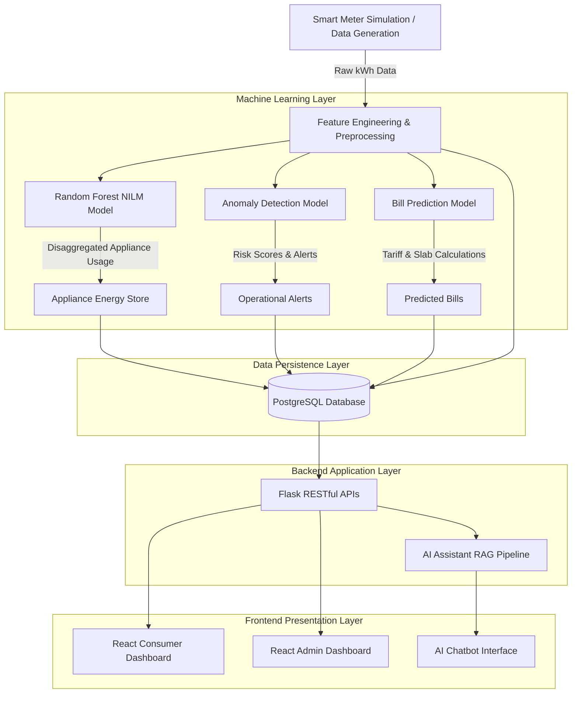
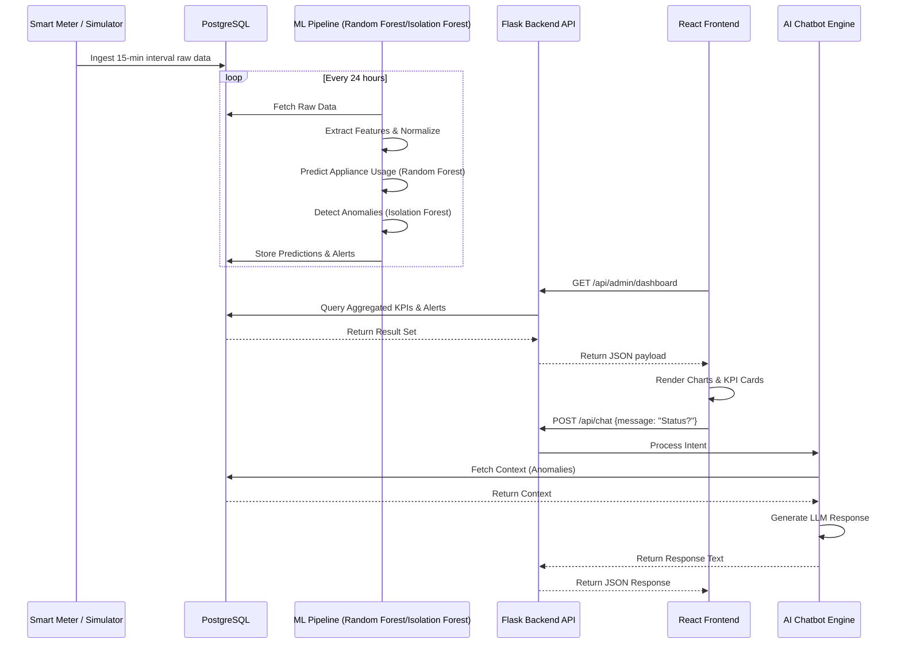

# Volume 00: Complete Project Workflow

## 1. Introduction to the End-to-End Workflow

The **AI Powered Smart Meter Energy Disaggregation and Consumer Analytics Platform** operates via a seamless, highly integrated pipeline. The workflow begins at the edge with the smart meter capturing 15-minute interval energy data and ends at the presentation layer, where consumers and administrators interact with insights via a React-based UI and an AI Energy Assistant Chatbot.

This volume meticulously details the step-by-step transition of data across the entire technology stack.

---

## 2. High-Level End-to-End Architecture

---

## 3. Detailed Step-by-Step Workflow

### 3.1 Data Generation and Capture
1. **Concept**: Because physical smart meters are not available for continuous physical testing, a highly sophisticated Data Loader simulates realistic smart meter behaviour.
2. **Internal Logic**: The data generator (`utils/data_loader.py`) models consumption based on household size, seasonal variations, time-of-day (peak vs. off-peak), and weekday vs. weekend patterns. It generates total consumption (`energy_kwh`), `voltage`, `current`, `power_factor`, and `frequency`.
3. **Database Flow**: This raw telemetry is injected into the PostgreSQL `smart_meter_data` table.

### 3.2 Feature Engineering
1. **Concept**: The raw time-series data must be transformed into stationary, highly correlated features for the Machine Learning models.
2. **Internal Logic**: Rolling averages (3-hour, 24-hour), hour-of-day encoding (sin/cos transformations to preserve cyclicity), day-of-week boolean flags, and power quality metrics (lagging vs leading power factor) are computed.
3. **Code Flow**: Triggered in `models/train_disaggregation_model.py` and `models/train_anomaly_model.py`.

### 3.3 Random Forest NILM (Energy Disaggregation)
1. **Concept**: Non-Intrusive Load Monitoring (NILM) breaks down the total household consumption into individual appliance estimates without installing individual sensors on each appliance.
2. **Internal Logic**: A trained Random Forest Regressor analyzes the engineered features. The model maps the non-linear relationship between time-of-day, total load, and appliance specific signatures (e.g., an air conditioner draws massive load during summer afternoons, while a refrigerator draws constant cyclical load).
3. **Database Flow**: Predictions are stored in the PostgreSQL `appliance_predictions` table.

### 3.4 Anomaly Detection
1. **Concept**: The system must flag abnormal consumption behaviour, potential theft, meter faults, or sudden inefficiencies.
2. **Internal Logic**: An Isolation Forest algorithm evaluates the multidimensional feature space (Total kWh, Power Factor, Voltage stability). Observations that require fewer splits to be isolated are flagged as anomalies.
3. **Business Rules**: Anomalies are mapped to Severity levels (Low, Medium, High, Critical) and categorized (e.g., "Power Factor Drop", "Unusual Peak Spikes").
4. **Database Flow**: Stored in the PostgreSQL `anomalies` table.

### 3.5 Bill Prediction
1. **Concept**: Consumers need proactive financial forecasting. The system predicts the end-of-month bill based on current trajectory.
2. **Internal Logic**: A combination of ML forecasting and hardcoded deterministic tariff rules. The forecasted kWh is passed through the regional tariff slab logic, adding fixed charges and subtracting applicable subsidies.
3. **Database Flow**: Stored and accessible via the `/api/consumer/<id>` endpoint.

### 3.6 PostgreSQL Database Layer
1. **Concept**: Centralized persistence layer acting as the absolute source of truth.
2. **Internal Logic**: Replaced the legacy SQLite implementation to support concurrent reads, complex joins (e.g., aggregating millions of smart meter rows for Zone Analytics), and ACID compliance. 
3. **Security Considerations**: Secured via roles, encrypted connections, and parameterized queries from Flask to prevent SQL injection.

### 3.7 Flask Backend (REST APIs)
1. **Concept**: The intermediary layer connecting the PostgreSQL database to the React frontend.
2. **Code Flow**: Built using `Flask` and `psycopg2` / `pandas` for rapid data manipulation. Endpoints route requests from the React frontend, execute SQL queries against PostgreSQL, format the data into JSON, and return it.
3. **API Flow**: 
   - `GET /api/admin/dashboard`
   - `GET /api/consumer/<id>`
   - `POST /api/chat`

### 3.8 AI Energy Assistant (Chatbot)
1. **Concept**: An interactive conversational agent capable of querying the live PostgreSQL database and translating operational insights into human-readable text.
2. **Code Flow**: When a user queries "Show critical consumers", the Intent Engine maps this to the `get_critical_consumers()` internal function. The function queries the DB, formats the exact Risk Scores, and injects them into a prompt. An LLM (e.g., Groq/Llama) synthesizes this into a natural response.

### 3.9 React Frontend (Admin & Consumer Dashboards)
1. **Concept**: The presentation layer.
2. **Consumer Dashboard**: Displays real-time Disaggregation Pie Charts, Green Energy Scores, Daily Trend lines, and AI Confidence metrics.
3. **Admin Dashboard**: Displays the Operational Alerts Queue, Zone Analytics, and system-wide revenue projections.

---

## 4. Sequence Diagram: Data to UI Flow

---

## Meta Information
- **Source files analyzed**: `app.py`, `models/*.py`, `database/dal.py`, `frontend/src/**/*.jsx`
- **Functions documented**: `train_all()`, `build_training_frame()`, `chat()`, `query_df()`, `getConsumer()`
- **Number of diagrams created**: 1-2 per volume (Mermaid Sequence/Architecture/ERD)
- **Key topics covered**: NILM, Anomaly Detection, Bill Prediction, React UI, PostgreSQL, Flask REST API
- **Cross-reference**: See [Volume 00](Volume_00_Project_Workflow.md) for master index.
