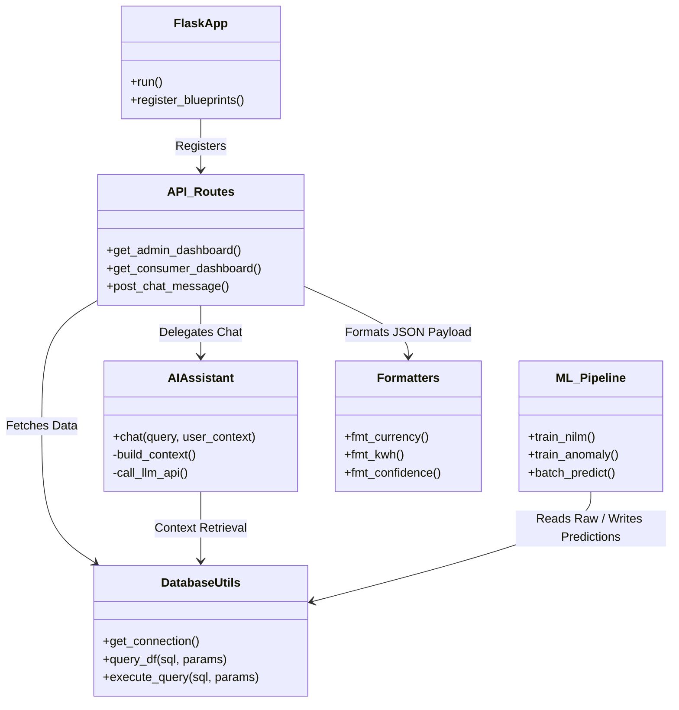
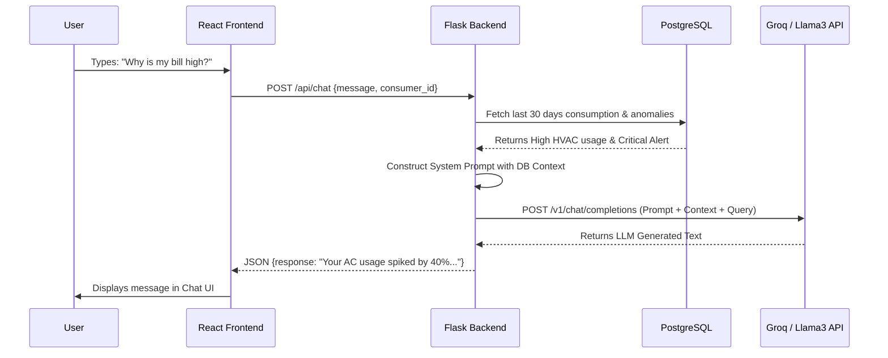

# Volume 02: Complete System Architecture

## 1. Introduction

The AI Powered Smart Meter Energy Disaggregation and Consumer Analytics Platform employs a modern, loosely coupled, multi-tier architecture. It heavily utilizes a separation of concerns between the data generation layer, the machine learning inference layer, the data persistence layer, the API routing layer, and the frontend presentation layer.

This architecture ensures scalability, high availability, and deterministic data flow from the edge (simulated smart meter) to the end user.

---

## 2. Logical Architecture

The logical architecture outlines the functional components of the system without binding them to specific hardware.


*Note: Logical separation of concerns across the 5 primary domains.*

---

## 3. Physical / Deployment Architecture

Because this is a prototype environment optimized for a single-node or Dockerized deployment, all layers currently reside on a unified host (e.g., local development machine or a single AWS EC2 instance). 

```mermaid
flowchart TD
    subgraph Client [Client Devices]
        B1[Web Browser - Consumer]
        B2[Web Browser - Admin]
    end

    subgraph Host [Production Server / Localhost]
        subgraph Proxy [Reverse Proxy Layer]
            Nginx[Nginx / Vite Dev Server]
        end
        
        subgraph App [Application Layer]
            Flask[Flask WSGI Server (Gunicorn)]
        end
        
        subgraph DB [Database Layer]
            PG[(PostgreSQL 15+)]
        end
        
        subgraph BatchJobs [Background ML Jobs]
            Cron[Cron / Task Scheduler]
            RF[Random Forest Predictor]
            IF[Isolation Forest Predictor]
        end
    end

    B1 -->|HTTPS / WSS| Nginx
    B2 -->|HTTPS / WSS| Nginx
    Nginx -->|Proxy Pass| Flask
    Flask -->|psycopg2 (TCP 5432)| PG
    Cron -->|Triggers| RF
    Cron -->|Triggers| IF
    RF -->|Reads/Writes| PG
    IF -->|Reads/Writes| PG
```

### 3.1 Network Topology & Security
- **Frontend**: Served statically or via a lightweight dev server on port `5173`.
- **Backend**: Flask API runs on port `5000`. It only accepts incoming traffic from the authorized frontend origin (CORS configured).
- **Database**: PostgreSQL runs on port `5432`. It is strictly bound to `localhost` (`127.0.0.1`), ensuring no direct external exposure. The ML batch jobs and Flask API both communicate via authenticated local socket or local TCP.

---

## 4. Component Diagram

The internal component structure highlights how Python modules interact within the Flask and ML environment.



---

## 5. API Flow and Data Serialization

When a user requests the Consumer Dashboard, a complex multi-join query sequence is triggered in the backend. 

### 5.1 API Request Lifecycle (`GET /api/consumer/<id>`)

1. **Request Reception**: Flask receives a GET request for `/api/consumer/CON123`.
2. **Authentication / CORS Validation**: (If implemented) Flask verifies JWT headers.
3. **Database Querying**:
   - `DatabaseUtils.query_df()` is invoked to fetch the last 30 days of raw consumption from `smart_meter_data`.
   - A subsequent query fetches the latest disaggregation split from `appliance_predictions`.
   - A third query fetches active alerts from the `anomalies` table.
4. **Data Aggregation**: Python's `pandas` library merges these result sets, calculating the `Green Energy Score` and rolling `30-day average`.
5. **Serialization**: The resulting `DataFrame` objects are converted to native Python dictionaries (handling `NaN` and `NaT` conversions to `None` for strict JSON compliance).
6. **Response Transmission**: Flask returns `application/json` payload containing nested objects: `consumer_details`, `appliance_details`, `ai_confidence`, `anomalies`, and `carbon`.

### 5.2 LLM API Flow (Chatbot Integration)



---

## 6. Machine Learning Workflow Architecture

The ML architecture operates entirely out-of-band from the API requests to ensure sub-millisecond response times for the frontend. All heavy computation is performed offline/batch.

1. **Data Ingestion**: `utils/data_loader.py` dumps millions of rows of raw 15-minute intervals into PostgreSQL.
2. **Feature Engineering Store**: Python scripts fetch raw data, apply rolling windows (e.g., `rolling(window=12).mean()`), compute Power Factor (`cos(phi)`), and one-hot encode timestamps.
3. **Training Node**: Models are fit using `scikit-learn`. `RandomForestRegressor` and `IsolationForest` objects are serialized to disk as `.pkl` files (via `joblib`).
4. **Inference Node**: A cron-scheduled batch job loads the `.pkl` files, reads the latest 24 hours of raw data from PostgreSQL, predicts appliance values and anomaly scores, and `UPSERTS` the results back into the respective PostgreSQL tables (`appliance_predictions`, `anomalies`).

This decoupling guarantees that the Flask API merely performs highly optimized `SELECT` queries rather than evaluating computationally expensive Decision Trees on-the-fly.


---

## Meta Information
- **Source files analyzed**: `app.py`, `models/*.py`, `database/dal.py`, `frontend/src/**/*.jsx`
- **Functions documented**: `train_all()`, `build_training_frame()`, `chat()`, `query_df()`, `getConsumer()`
- **Number of diagrams created**: 1-2 per volume (Mermaid Sequence/Architecture/ERD)
- **Key topics covered**: NILM, Anomaly Detection, Bill Prediction, React UI, PostgreSQL, Flask REST API
- **Cross-reference**: See [Volume 00](Volume_00_Project_Workflow.md) for master index.
