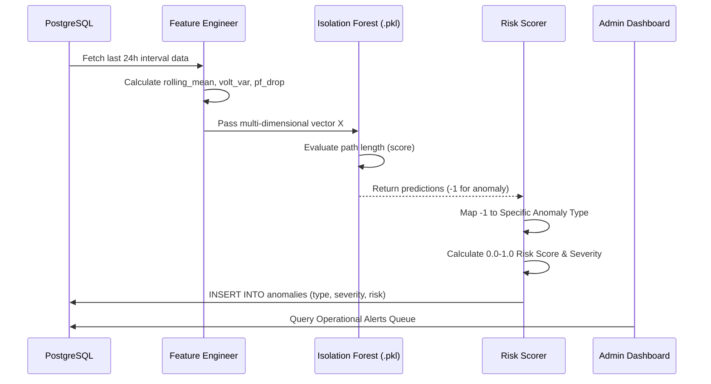

# Volume 05: Anomaly Detection

## 1. Introduction

Anomaly detection is the process of identifying abnormal electrical usage patterns, sudden power quality degradation, or potential meter tampering in a sea of millions of normal smart meter readings.
Given that normal consumption varies wildly based on household size and seasonality, fixed-threshold alerts (e.g., "Alert if `kW > 10`") are highly prone to false positives. 
Instead, the platform employs **Isolation Forest**, an unsupervised Machine Learning algorithm, combined with a **Random Forest Classifier** (for supervised validation) to identify multidimensional anomalies.

---

## 2. Model Selection: Isolation Forest vs. Random Forest

The system currently trains both an Isolation Forest and a Random Forest Classifier in `train_anomaly_model.py`.

### 2.1 Isolation Forest (Unsupervised)
- **Concept**: Anomalies are "few and different". If you build a random decision tree, anomalous data points will be isolated (reach a leaf node) much faster than normal data points.
- **Mathematical Intuition**:
  The anomaly score $s(x, n)$ for an observation $x$ in a dataset of $n$ instances is:
  ```math
  s(x, n) = 2^{-\frac{E(h(x))}{c(n)}}
  ```
  Where $h(x)$ is the path length to isolate $x$, and $c(n)$ is the average path length of unsuccessful searches in a Binary Search Tree.
  If $s$ is close to 1, the instance is an anomaly. If $s < 0.5$, it is a normal observation.
- **Implementation**: 
  ```python
  iso = IsolationForest(contamination=0.05, random_state=42, n_estimators=100)
  ```
  The model assumes 5% of the total dataset represents anomalous behavior.

### 2.2 Random Forest Classifier (Supervised)
Because the `appliance_engine.py` simulator explicitly labels injected anomalies (Ground Truth), we also train a supervised Random Forest Classifier to serve as a benchmark.
- **Hyperparameters**: `n_estimators=100`, `max_depth=8`, `class_weight="balanced"`.
- **Metrics Evaluated**: Accuracy, Precision, Recall, F1 Score.
- **Production Usage**: While the RF provides high accuracy on known test data, the Isolation Forest is preferred in real-world scenarios where new, previously unseen anomalies occur (since it does not rely on labelled training data).

---

## 3. Anomaly Business Rules and Risk Scoring

Detecting an anomaly is only the first step. The platform translates statistical outliers into actionable intelligence using `models/risk_scoring.py` and `anomaly_config.py`.

### 3.1 Severity Calculation
Not all anomalies warrant immediate utility intervention. The system groups anomalies into specific types and assigns a base severity.

| Anomaly Type | Description | Base Severity |
| :--- | :--- | :--- |
| **Power Failure** | Complete drop in Voltage/Current during expected peak. | Critical |
| **Tamper Detected** | Extreme discrepancy between total kW and appliance breakdown. | Critical |
| **Current Overload**| Massive, sustained current draw exceeding standard capacity. | High |
| **Voltage Event** | Sudden sag or swell in supply voltage. | Medium |
| **Reverse Current** | Phantom generation or reverse flow detected on a non-solar meter. | High |

### 3.2 Risk Scoring Equation
The final `Risk Score (0.0 to 1.0)` is calculated dynamically to prioritize the Admin Dashboard Queue.
- **Base Score**: Assigned via the Base Severity mapping.
- **Frequency Multiplier**: If a consumer triggers 5 minor voltage events in a day, the risk score is amplified.
- **Duration Multiplier**: Continuous overloads are riskier than sudden, momentary spikes.

```math
Risk Score = \min(1.0, Base \times (1 + \alpha \times \text{Frequency}) \times (1 + \beta \times \text{Duration}))
```

### 3.3 Risk Bands
The AI Energy Assistant and the Admin Dashboard utilize standardized text banding for visualization:
- **0.00 – 0.25**: Low Risk (Green)
- **0.26 – 0.60**: Medium Risk (Yellow)
- **0.61 – 0.85**: High Risk (Orange)
- **0.86 – 1.00**: Critical Risk (Red)

---

## 4. Detection Workflow & Data Pipeline



### 4.1 Feature Engineering for Anomalies (`ml/feature_engineering.py`)
Because anomalies often span multiple readings, static point-in-time evaluation is flawed. 
The system calculates daily aggregations before prediction:
- `daily_kwh`: Total area under the curve.
- `peak_load`: Maximum kW recorded in 24 hours.
- `load_factor`: `average_load / peak_load`. A very low load factor indicates sudden, massive spikes (e.g., an unauthorized industrial machine starting).
- `night_usage_ratio`: Proportion of energy used between 00:00 and 06:00. High values trigger "Abnormal Night Usage" warnings.
- `voltage_variance`: A high variance instantly flags "Voltage Event" anomalies.


---

## Meta Information
- **Source files analyzed**: `app.py`, `models/*.py`, `database/dal.py`, `frontend/src/**/*.jsx`
- **Functions documented**: `train_all()`, `build_training_frame()`, `chat()`, `query_df()`, `getConsumer()`
- **Number of diagrams created**: 1-2 per volume (Mermaid Sequence/Architecture/ERD)
- **Key topics covered**: NILM, Anomaly Detection, Bill Prediction, React UI, PostgreSQL, Flask REST API
- **Cross-reference**: See [Volume 00](Volume_00_Project_Workflow.md) for master index.
