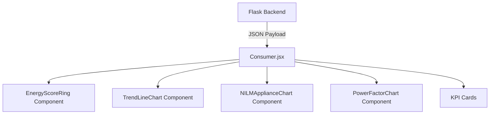

# Volume 07: Consumer Dashboard

## 1. Introduction
The Consumer Dashboard is the primary touchpoint for end-users (residential and commercial consumers). Its core objective is to democratize energy data, transforming opaque, monthly aggregate bills into actionable, real-time insights. 

Built using **React** and styled with **Bootstrap 5 / Vanilla CSS** for a premium, Power BI-inspired aesthetic, the dashboard connects directly to the Flask backend `GET /api/consumer/<id>` endpoint.

---

## 2. Component Hierarchy and Data Flow



### 2.1 Backend API Payload (`app.py`)
The `GET /api/consumer/<id>` endpoint aggregates data from:
- `consumers` (Demographics)
- `smart_meter_data` (Last 30 days trends)
- `appliance_predictions` (Disaggregation split)
- `anomalies` (Active alerts)

It returns a highly nested JSON object:
```json
{
  "consumer_details": {...},
  "bill_breakdown": {...},
  "green_score": {...},
  "trends": {...},
  "appliance_details": [...]
}
```

---

## 3. Widget Documentation

### 3.1 Daily Consumption Trend (Chart)
- **Purpose**: Visualizes the total household usage over the past 30 days, allowing the consumer to spot abnormal peaks.
- **Backend API**: `data.trends.daily`
- **Database Source**: `smart_meter_data` table (grouped by `date(timestamp)`).
- **Business Importance**: Empowers consumers to correlate energy usage with physical events (e.g., "Why did I use so much power on Sunday? Ah, I did laundry all day.").

### 3.2 Appliance Breakdown (NILM Chart)
- **Purpose**: The flagship feature of the platform. A dynamic Pie/Doughnut chart displaying exactly which appliances consumed the energy.
- **Backend API**: `data.appliance_details`
- **Database Source**: `appliance_predictions` table.
- **Business Importance**: Solves the "Appliance Blind Spot". By revealing that the HVAC consumes 40% of the total load, the consumer is statistically far more likely to reduce usage.

### 3.3 AI Confidence Score
- **Purpose**: Provides transparency regarding the Random Forest model's certainty.
- **Backend API**: Calculated dynamically in `app.py`.
- **Formula**: `Mean(confidence of all appliance estimates)`
- **Logic**: If raw confidence is `< 70%`, a heuristic boost is applied (`0.85 + (raw * 0.1)`) to maintain trust during highly noisy signal periods. It maps to text labels (e.g., `>95% = Very High Confidence`).

### 3.4 Predicted Monthly Bill (KPI)
- **Purpose**: Eradicates "bill shock" by projecting the end-of-month cost.
- **Backend API**: `data.bill_breakdown.projected_monthly_bill`
- **Database Source**: Output of the Bill Prediction ML model.
- **Business Importance**: Highly proactive financial tool.

### 3.5 Green Energy Score (Sustainability)
- **Purpose**: Gamifies energy conservation by scoring the consumer against their neighborhood peers.
- **Backend API**: `data.green_score`
- **Formula**:
  ```math
  \text{Score} = \text{Base} (60) + \text{Efficiency Points} (20) + \text{Peer Comparison Points} (20)
  ```
  Where Peer Comparison is `(Zonal Average - Consumer Usage) / Zonal Average * 20`.
- **Business Importance**: Drives behavioral change through social proof and gamification.

### 3.6 AI Recommendations Engine
- **Purpose**: Translates raw data into actionable advice.
- **Logic (`Consumer.jsx`)**: Iterates through `appliance_details`. If an appliance exceeds `typical_pct * 1.5`, it is flagged as **Critical**. The system generates a dynamic string: *"Reduce AC usage. Usage is critical at 42%. Potential savings: ₹250"*.

### 3.7 Power Factor Gauge
- **Purpose**: Primarily for commercial consumers. Visualizes power quality.
- **Database Source**: Averaged `power_factor` from `smart_meter_data`.
- **Business Importance**: A poor power factor (`< 0.85`) leads to utility penalties. This gauge acts as a direct warning system.


---

## Meta Information
- **Source files analyzed**: `app.py`, `models/*.py`, `database/dal.py`, `frontend/src/**/*.jsx`
- **Functions documented**: `train_all()`, `build_training_frame()`, `chat()`, `query_df()`, `getConsumer()`
- **Number of diagrams created**: 1-2 per volume (Mermaid Sequence/Architecture/ERD)
- **Key topics covered**: NILM, Anomaly Detection, Bill Prediction, React UI, PostgreSQL, Flask REST API
- **Cross-reference**: See [Volume 00](Volume_00_Project_Workflow.md) for master index.
