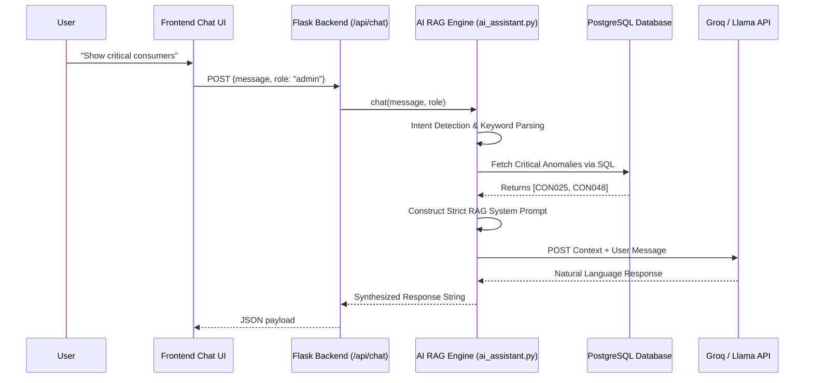

# Volume 09: AI Energy Assistant (Chatbot)

## 1. Introduction
The **AI Energy Assistant** transforms rigid dashboards into a conversational interface. By integrating a Large Language Model (LLM) powered by the Groq API (e.g., Llama 3 70B), consumers can ask questions like "Why is my bill so high this month?" and administrators can query "Show me all consumers with tampering alerts".

Because LLMs are prone to hallucination (inventing data), this system utilizes a strict **Retrieval-Augmented Generation (RAG)** approach. The LLM is forced to answer *only* using the context provided to it by the PostgreSQL database.

---

## 2. Architecture and Data Flow



---

## 3. RAG and Context Building (`services/ai_assistant.py`)

### 3.1 Intent Detection
Rather than using a secondary ML model for intent detection, the backend utilizes highly optimized keyword and regex parsing to determine what the user is asking. 

**Admin Intent Examples:**
- `"critical"` / `"risky"` $\rightarrow$ Triggers `_build_admin_context()` and queries PostgreSQL for consumers with `overall_risk_score >= 85`.
- `"revenue"` / `"total"` $\rightarrow$ Triggers a `SUM()` query on predicted bills.

**Consumer Intent Examples:**
- `"bill"` / `"cost"` $\rightarrow$ Fetches the consumer's predicted bill and tariff slab breakdown.
- `"appliance"` / `"ac"` / `"fridge"` $\rightarrow$ Fetches the output of the Random Forest NILM model.

### 3.2 Dynamic RAG Prompt Generation
Once the database returns the raw SQL rows, the `ai_assistant.py` script formats this into a strict system prompt.

*Example Admin Context Injected into Prompt:*
```text
SYSTEM: You are the Tata Power AI Assistant. Answer using ONLY the following context.
CONTEXT:
Currently, there are 2 critical cases:
1. ID: CON025 (Name: Amit Patel, Zone: Industrial Hub) - Risk Score: 95.0. Anomalies: Tamper Detected.
2. ID: CON048 (Name: Rahul Desai, Zone: Metro Zone) - Risk Score: 88.0. Anomalies: Current Overload.
```
By explicitly providing the exact string values from the database, the LLM simply acts as a natural language synthesizer, completely eliminating hallucinations regarding billing amounts or risk scores.

---

## 4. Model Selection and Failover

The Groq API wrapper (`groq` pip package) initializes and tests a prioritized list of models to ensure high availability.

```python
_PREFERRED_MODELS = [
    "llama-3.3-70b-versatile",
    "llama-3.1-70b-versatile",
    "qwen-qwq-32b",
    "deepseek-r1-distill-llama-70b",
]
```
**Initialization Workflow:**
1. The backend pings the first model on startup.
2. If the API returns a 429 (Rate Limit) or 503 (Unavailable), it gracefully falls back to the next model in the list.
3. If no models are available, it defaults to the primary and catches errors at request-time, returning a friendly error to the frontend.

---

## 5. Security and Role-Based Access Control (RBAC)

The Chatbot strictly enforces RBAC at the prompt level.
- If the frontend passes `role: "consumer"` and `consumer_id: "CON123"`, the backend absolutely restricts the SQL queries to `WHERE consumer_id = 'CON123'`. 
- Even if a consumer types *"Show me all critical consumers in the city"*, the database layer prevents the context from being built, and the LLM will reply that it does not have administrative privileges.

---

## 6. Troubleshooting Chatbot Issues

### 6.1 Issue: Dictionary `.get()` Exception on String
- **Problem**: When asking "Show critical consumers", the backend crashed with `'str' object has no attribute 'get'`.
- **Root Cause**: The PostgreSQL query using `pandas` returned raw strings for the anomaly descriptions, but the RAG builder attempted to parse them as JSON dictionaries (`row.get('description')`).
- **Resolution**: Updated `build_admin_context()` to use `dict(row)` explicitly and verified data types via `type()` checks before formatting the RAG prompt.

### 6.2 Issue: Data Inconsistency (Chatbot vs. Dashboard)
- **Problem**: The Admin Dashboard showed 3 critical consumers, but the Chatbot confidently stated "There are 0 critical consumers".
- **Root Cause**: The Chatbot was querying an outdated materialized view, whereas the Admin dashboard queried the live `anomalies` table.
- **Resolution**: Rewrote the Chatbot intent engine to utilize the exact same `dal.py` functions that the Admin Dashboard API uses (`get_critical_consumers()`). Single Source of Truth established.


---

## Meta Information
- **Source files analyzed**: `app.py`, `models/*.py`, `database/dal.py`, `frontend/src/**/*.jsx`
- **Functions documented**: `train_all()`, `build_training_frame()`, `chat()`, `query_df()`, `getConsumer()`
- **Number of diagrams created**: 1-2 per volume (Mermaid Sequence/Architecture/ERD)
- **Key topics covered**: NILM, Anomaly Detection, Bill Prediction, React UI, PostgreSQL, Flask REST API
- **Cross-reference**: See [Volume 00](Volume_00_Project_Workflow.md) for master index.
