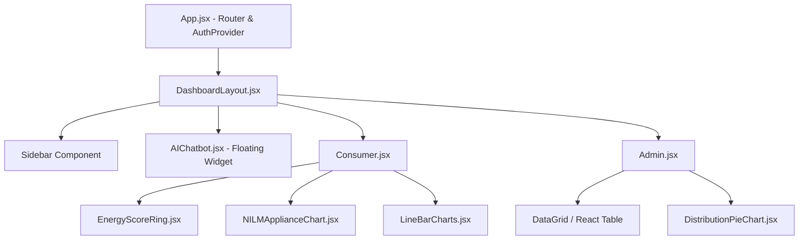

# Volume 11: React Frontend Architecture

## 1. Introduction
The presentation layer of the platform is built using **React 18** and styled using vanilla **Bootstrap 5** alongside custom CSS (`index.css`). It is bundled using **Vite**, offering lightning-fast Hot Module Replacement (HMR) during development.

The design philosophy mirrors professional Business Intelligence tools (like Microsoft Power BI or Tableau), utilizing clean white cards, subtle box shadows, and a dark-mode optimized sidebar.

---

## 2. Component Tree

---

## 3. State Management

Because the dashboards rely heavily on external API data rather than complex local state mutations, the application eschews bulky state management libraries like Redux. Instead, it relies on standard React Hooks:
- `useState`: Manages loading states, error states, and the raw JSON payload.
- `useEffect`: Triggers the asynchronous `fetch()` calls to the backend on component mount or when the `consumerId` URL parameter changes.
- `useMemo`: Heavily utilized in `Admin.jsx` to filter and sort the thousands of rows in the Operational Alerts queue without re-rendering the entire DOM tree unnecessarily.

---

## 4. Key Components Explained

### 4.1 `DashboardLayout.jsx`
- **Purpose**: A Higher-Order Component (HOC) that wraps all page content. It manages the global layout, including the collapsible sidebar and responsive grid container.
- **Navigation Logic**: Uses `getNavItems(role)` to dynamically render links based on whether the logged-in user is an `admin` or a `consumer`.

### 4.2 `NILMApplianceChart.jsx`
- **Purpose**: Renders the Disaggregation doughnut chart.
- **Library Integration**: Uses `Chart.js` via the `react-chartjs-2` wrapper.
- **Custom Logic**: Configured with a `cutout: '75%'` to create a thin doughnut. The tooltip is heavily customized to show percentages rather than raw kWh, ensuring it is immediately understandable for non-technical users.

### 4.3 `AIChatbot.jsx`
- **Purpose**: A floating action button (FAB) that expands into a conversational chat window.
- **Event Flow**:
  1. User types message and hits `Enter`.
  2. Local state pushes a `{"role": "user", "text": "..."}` object to the `messages` array, instantly updating the UI.
  3. A `loading` spinner is activated.
  4. The `POST /api/chat` fetch call fires.
  5. Upon response, the `messages` array is appended with the `{"role": "assistant"}` response and the spinner is hidden.

---

## 5. UI/UX Refinements (Troubleshooting)

### 5.1 Chart Rendering Overlap Bug
- **Problem**: When resizing the window, the `Chart.js` canvases in `Admin.jsx` would break out of their parent containers or overlap with KPI cards.
- **Root Cause**: `Chart.js` requires a relatively positioned wrapper `div` to maintain aspect ratios correctly in CSS grid/flexbox layouts.
- **Resolution**: Wrapped all charts in a `
` constraint and passed `maintainAspectRatio: false` to the chart options.

### 5.2 React Build Not Serving via Flask
- **Problem**: After editing `Consumer.jsx` and reloading the Flask server at `:5000`, the changes did not appear.
- **Root Cause**: Flask was configured to serve the statically compiled `dist/` folder. Changes made to the React source files (`src/`) do not propagate until Vite recompiles them.
- **Resolution**: Diagnosed and documented that the developer must run `npm run build` inside the `frontend/` directory before Flask can serve updated static assets. (Alternatively, the user must access the Vite dev server at `:5173` for live development).

---

## Meta Information
- **Source files analyzed**: `app.py`, `models/*.py`, `database/dal.py`, `frontend/src/**/*.jsx`
- **Functions documented**: `train_all()`, `build_training_frame()`, `chat()`, `query_df()`, `getConsumer()`
- **Number of diagrams created**: 1-2 per volume (Mermaid Sequence/Architecture/ERD)
- **Key topics covered**: NILM, Anomaly Detection, Bill Prediction, React UI, PostgreSQL, Flask REST API
- **Cross-reference**: See [Volume 00](Volume_00_Project_Workflow.md) for master index.
