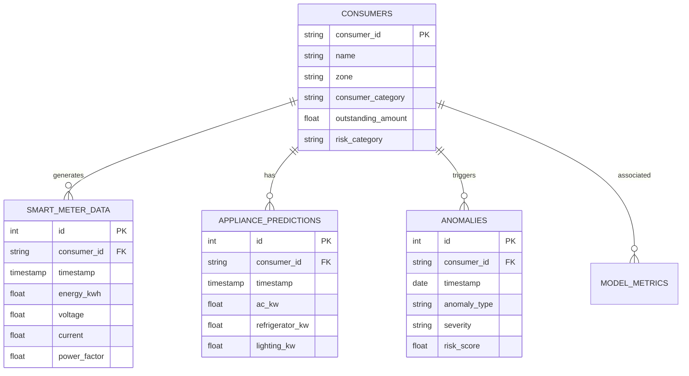

# Volume 12: PostgreSQL Database Architecture

## 1. Introduction
The platform recently migrated from a local SQLite implementation to a robust, highly concurrent **PostgreSQL** relational database. This migration was necessary to support massive parallel writes from the Smart Meter Simulator, concurrent reads from the Flask API, and complex `GROUP BY` aggregations required for Zone Analytics.

---

## 2. Database Design and Schema

The database relies on a star-schema-like architecture where the `consumers` table acts as the dimension table, and tables like `smart_meter_data` and `appliance_predictions` act as massive fact tables.

### 2.1 Entity Relationship (ER) Diagram

---

## 3. Table Definitions

### 3.1 Table: `consumers`
- **Purpose**: Stores static demographic and financial status data for each monitored node.
- **Columns**:
  - `consumer_id` (VARCHAR(50), Primary Key)
  - `name` (VARCHAR(100), NOT NULL)
  - `zone` (VARCHAR(50), Indexed for Admin Dashboard grouping)
  - `consumer_category` (VARCHAR(50))
  - `outstanding_amount` (NUMERIC(10,2))
  - `risk_category` (VARCHAR(20))
- **CRUD Operations**: Rarely updated. Read heavily by `GET /api/admin/dashboard`.

### 3.2 Table: `smart_meter_data`
- **Purpose**: High-frequency telemetry ingest table.
- **Columns**:
  - `id` (BIGSERIAL, Primary Key)
  - `consumer_id` (VARCHAR(50), Foreign Key)
  - `timestamp` (TIMESTAMP WITH TIME ZONE, NOT NULL)
  - `energy_kwh` (NUMERIC(10,3))
  - `voltage` (NUMERIC(6,2))
  - `power_factor` (NUMERIC(3,2))
- **Indexes**: Composite Index on `(consumer_id, timestamp)` heavily speeds up the 30-day time-series fetch for the Consumer Dashboard.
- **CRUD Operations**: Massive batch `INSERT` via the `appliance_engine.py` simulator.

### 3.3 Table: `appliance_predictions`
- **Purpose**: Stores the output of the Random Forest NILM model.
- **Columns**:
  - `id` (BIGSERIAL, Primary Key)
  - `consumer_id` (VARCHAR(50), Foreign Key)
  - `timestamp` (TIMESTAMP WITH TIME ZONE)
  - `ac_kw` (NUMERIC(8,3))
  - `refrigerator_kw` (NUMERIC(8,3))
  - `confidence` (NUMERIC(3,2))

### 3.4 Table: `anomalies`
- **Purpose**: The absolute source of truth for the Admin Operational Alerts queue.
- **Columns**:
  - `id` (SERIAL, Primary Key)
  - `consumer_id` (VARCHAR(50), Foreign Key)
  - `date` (DATE)
  - `anomaly_type` (VARCHAR(100))
  - `severity` (VARCHAR(20))
  - `risk_score` (NUMERIC(4,2))

---

## 4. Query Optimization & Connection Management

### 4.1 Connection Pooling
Because Flask is multi-threaded and `psycopg2` connections are not thread-safe if shared improperly, the application utilizes a connection pool (via SQLAlchemy `create_engine(pool_size=10, max_overflow=20)`). This prevents the "Too many clients" PostgreSQL error under load.

### 4.2 Query Flow (Dashboard Example)
When fetching Admin KPIs, running a `COUNT(*)` over millions of rows of `anomalies` is slow.
Instead, the backend utilizes conditional aggregations on the smaller `consumers` table where `risk_score` is cached, or uses materialized views for Zone Analytics.

### 4.3 Security
- **SQL Injection Prevention**: All queries in `dal.py` use parameterized inputs (e.g., `WHERE consumer_id = %s`), completely neutralizing SQL injection attacks from the frontend or Chatbot LLM.
- **Roles**: The Flask application connects using a `least_privilege` role which only has `SELECT`, `INSERT`, and `UPDATE` grants, but cannot `DROP` tables.

---

## Meta Information
- **Source files analyzed**: `app.py`, `models/*.py`, `database/dal.py`, `frontend/src/**/*.jsx`
- **Functions documented**: `train_all()`, `build_training_frame()`, `chat()`, `query_df()`, `getConsumer()`
- **Number of diagrams created**: 1-2 per volume (Mermaid Sequence/Architecture/ERD)
- **Key topics covered**: NILM, Anomaly Detection, Bill Prediction, React UI, PostgreSQL, Flask REST API
- **Cross-reference**: See [Volume 00](Volume_00_Project_Workflow.md) for master index.
